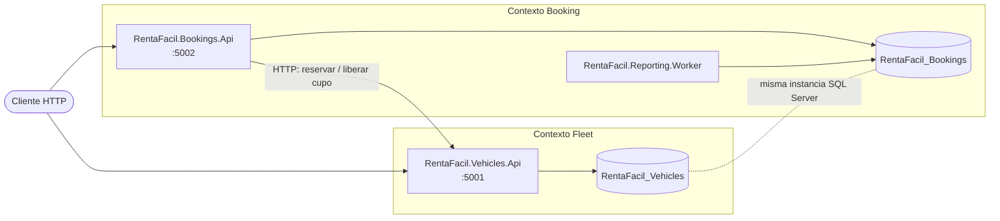
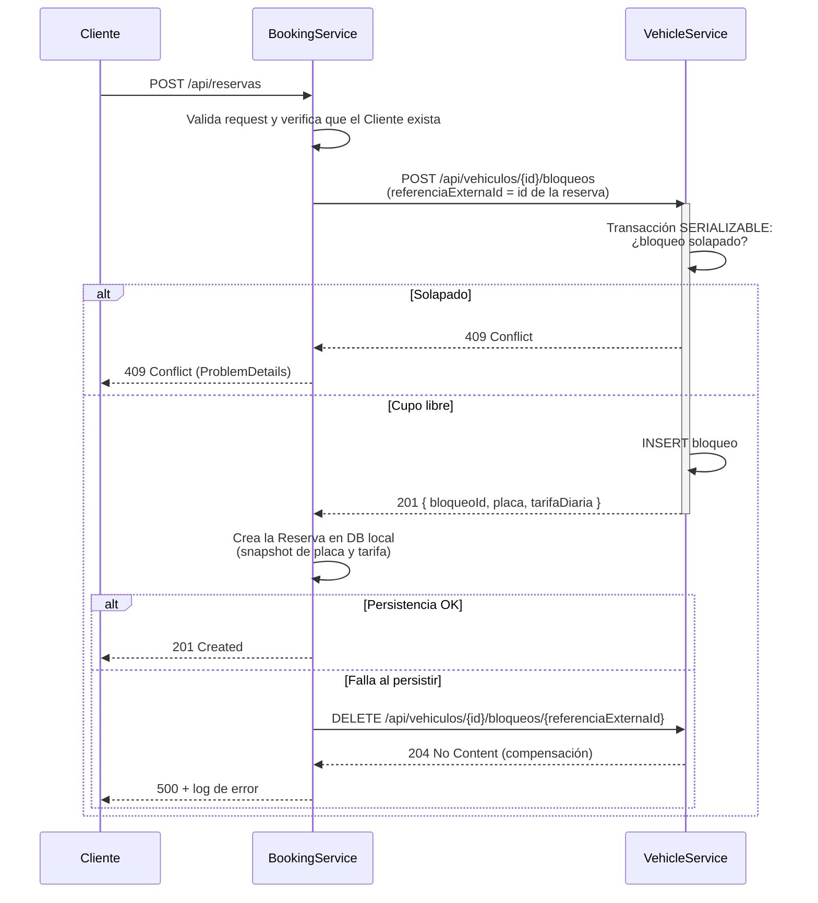

# RentaFácil S.A.S. — Backend de gestión de reservas de vehículos

## 1. Qué es

Sistema de gestión de reservas de vehículos para RentaFácil S.A.S.: dos
microservicios (`VehicleService`, `BookingService`) y un worker de reportes,
construidos en **.NET 8** con **Clean Architecture** y **DDD táctico**.

El alcance de esta prueba técnica es **solo backend**: no incluye frontend
Angular ni despliegue en Azure. Es una decisión consciente, documentada en
[`ARCHITECTURE.md`](./ARCHITECTURE.md) (checklist final), no una omisión.

> El diseño completo, con cada decisión y su justificación, está en
> [`ARCHITECTURE.md`](./ARCHITECTURE.md). Este README resume lo necesario para
> levantar el sistema y evaluarlo; para el detalle de una regla de negocio, un
> trade-off o una entidad, referirse siempre al documento de arquitectura.

---

## 2. Arquitectura

Tres ejecutables, dos bounded contexts, dos bases de datos en la misma instancia
de SQL Server:



| Contexto | Ejecutable | Responsabilidad |
|---|---|---|
| Fleet | `RentaFacil.Vehicles.Api` | Registro de vehículos y consulta de disponibilidad |
| Booking | `RentaFacil.Bookings.Api` | Clientes, creación de reservas e historial |
| Booking | `RentaFacil.Reporting.Worker` | Consolidación diaria de reservas en tabla de reportes |

No hay joins ni transacciones cruzadas entre contextos: toda comunicación entre
`Vehicles.*` y `Bookings.*` es HTTP explícito (§7 de `ARCHITECTURE.md`).

### Capas (Clean Architecture)

Cada servicio sigue la misma regla de dependencias: `Api → Application → Domain
→ SharedKernel`, con `Infrastructure` implementando los puertos que `Application`
define. `Domain` no conoce EF Core, MediatR ni ASP.NET.

| Capa | Responsabilidad |
|---|---|
| **SharedKernel** | Primitivas de dominio (`Entity`, `ValueObject`, `AggregateRoot`), `Result<T>`/`Error` y abstracciones (`IUnitOfWork`, `IDateTimeProvider`) comunes a ambos contextos |
| **Domain** | Entidades, agregados, value objects, invariantes de negocio e interfaces de repositorio — sin dependencias externas |
| **Application** | Casos de uso con MediatR (commands/queries), validadores FluentValidation, DTOs y los puertos hacia servicios externos |
| **Infrastructure** | `DbContext`, configuraciones Fluent API, repositorios, migraciones y el `HttpClient` tipado — implementa los puertos de `Application` |
| **Api** | Controladores delgados, middleware de errores, Swagger y composición de DI — cero lógica de negocio |
| **Worker** | `BackgroundService` con la programación (cron); la lógica de agregación vive en `Bookings.Application` |

Ver `ARCHITECTURE.md` §1–§2 para la estructura de carpetas completa y §3 para
las entidades y sus índices.

### Flujo de creación de reserva

Es la parte más interesante del sistema: `BookingService` no calcula
disponibilidad, se la pide a `VehicleService` dentro de una transacción
`SERIALIZABLE`, y compensa si algo falla después (detalle completo en
`ARCHITECTURE.md` §7):



---

## 3. Requisitos previos

- [.NET 8 SDK](https://dotnet.microsoft.com/download/dotnet/8.0) o superior (el TFM de todos los proyectos es `net8.0`)
- [Docker Desktop](https://www.docker.com/products/docker-desktop/)
- `dotnet-ef` 8.x (`dotnet tool install --global dotnet-ef --version 8.*`) — solo necesario para la ruta "Desde el IDE" o para aplicar migraciones manualmente

---

## 4. Ejecución local

### Con Docker Compose

```bash
docker compose up --build -d
```

Esto levanta tres contenedores además de SQL Server:

| Servicio | Puerto host | Nota |
|---|---|---|
| `sqlserver` | **14330** → 1433 | Se publica en 14330, no en el 1433 por defecto, para no chocar con una instancia de SQL Server ya instalada localmente en la máquina de desarrollo |
| `vehicle-service` | 5001 → 8080 | `RentaFacil.Vehicles.Api` |
| `booking-service` | 5002 → 8080 | `RentaFacil.Bookings.Api`, con `VehicleService__BaseUrl=http://vehicle-service:8080` |
| `reporting-worker` | (sin puerto expuesto) | Corre en segundo plano, `EjecutarAlIniciar: true` |

Es un solo comando y deja el sistema listo para usar: las tres apps corren con
`ASPNETCORE_ENVIRONMENT`/`DOTNET_ENVIRONMENT=Development` (`docker-compose.yml`
— es un entorno de desarrollo local por definición), así que cada API aplica
sus migraciones al arrancar y expone Swagger, sin ningún paso manual. Las APIs
quedan disponibles en `http://localhost:5001` y `http://localhost:5002`.

### Desde el IDE

```bash
# 1. Solo el contenedor de SQL Server
docker compose up -d sqlserver

# 2. Migraciones (Development → conecta a localhost,14330)
dotnet ef database update -p src/VehicleService/RentaFacil.Vehicles.Infrastructure -s src/VehicleService/RentaFacil.Vehicles.Api
dotnet ef database update -p src/BookingService/RentaFacil.Bookings.Infrastructure -s src/BookingService/RentaFacil.Bookings.Api

# 3. Los tres proyectos (en tres terminales separadas)
dotnet run --project src/VehicleService/RentaFacil.Vehicles.Api
dotnet run --project src/BookingService/RentaFacil.Bookings.Api
dotnet run --project src/BookingService/RentaFacil.Reporting.Worker
```

En este modo (`Development`, el que trae `launchSettings.json`) cada API aplica
sus propias migraciones al arrancar y expone Swagger, sin parámetros extra:
`launchSettings.json` ya fija el puerto de cada API en 5001/5002, para que
coincidan con `VehicleService:BaseUrl=http://localhost:5001` de
`appsettings.Development.json` de `RentaFacil.Bookings.Api`.

Swagger:
- VehicleService: http://localhost:5001/swagger/index.html
- BookingService: http://localhost:5002/swagger/index.html

### Inspeccionar las bases de datos

Desde SSMS (u otro cliente), con el contenedor de SQL Server arriba (por
cualquiera de las dos rutas):

```
Servidor:   localhost,14330
Usuario:    sa
Contraseña: Rent4F4cil!2026
```

Las bases son `RentaFacil_Vehicles` y `RentaFacil_Bookings`.

> Las credenciales de `docker-compose.yml` son solo para desarrollo local — no
> están pensadas para ningún entorno real.

---

## 5. Endpoints

### VehicleService — `http://localhost:5001`

| Método | Ruta | Descripción | Códigos |
|---|---|---|---|
| `POST` | `/api/vehiculos` | Registrar vehículo | 201, 400, 409 |
| `GET` | `/api/vehiculos/disponibilidad?tipo=&fechaInicio=&fechaFin=` | Disponibilidad por tipo y rango de fechas | 200, 400 |
| `POST` | `/api/vehiculos/{id}/bloqueos` | Reservar el cupo | 201, 404, 409 |
| `DELETE` | `/api/vehiculos/{id}/bloqueos/{referenciaExternaId}` | Liberar cupo (compensación) | 204, 404 |

### BookingService — `http://localhost:5002`

| Método | Ruta | Descripción | Códigos |
|---|---|---|---|
| `POST` | `/api/clientes` | Registrar cliente | 201, 400, 409 |
| `POST` | `/api/reservas` | Crear reserva asociando cliente y vehículo | 201, 400, 404, 409, 503 |
| `GET` | `/api/clientes/{clienteId}/reservas` | Historial de reservas del cliente | 200, 404 |

> **Los dos endpoints de bloqueos (`POST`/`DELETE .../bloqueos`) son de uso
> interno entre servicios.** Los invoca `BookingService` dentro del flujo de
> `POST /api/reservas` (ver diagrama de secuencia arriba); no son
> funcionalidad de cara al usuario final de la aplicación.

Swagger (documentación interactiva, disponible con cualquiera de las dos rutas
de ejecución del §4): http://localhost:5001/swagger/index.html ·
http://localhost:5002/swagger/index.html

---

## 6. Flujo de prueba end-to-end

Secuencia verificada con `curl` contra ambos servicios corriendo (Docker
Compose o IDE, con las migraciones ya aplicadas). Las fechas usan `+N días`
porque el dominio no permite reservar en el pasado (`RN-P02`); si ejecutas esto
mucho después, ajusta `fechaInicio`/`fechaFin` a un rango futuro.

```bash
# 1. Registrar vehículo
curl -s -X POST http://localhost:5001/api/vehiculos \
  -H "Content-Type: application/json" \
  -d '{"placa":"ABC123","tipo":"SUV","marca":"Toyota","modelo":"RAV4","anio":2024,"tarifaDiaria":150000,"moneda":"COP"}'
# -> 201 { "id": "<vehiculoId>", "placa": "ABC123", ... }

# 2. Registrar cliente
curl -s -X POST http://localhost:5002/api/clientes \
  -H "Content-Type: application/json" \
  -d '{"tipoDocumento":"CC","numeroDocumento":"1099999999","nombreCompleto":"Ana Test","email":"ana.test@example.com","telefono":"3001234567"}'
# -> 201 { "id": "<clienteId>", "documento": "CC:1099999999", ... }

# 3. Crear reserva (usa los ids de los dos pasos anteriores)
curl -s -X POST http://localhost:5002/api/reservas \
  -H "Content-Type: application/json" \
  -d '{"clienteId":"<clienteId>","vehiculoId":"<vehiculoId>","fechaInicio":"2026-09-10","fechaFin":"2026-09-15"}'
# -> 201 { "id": "<reservaId>", "valorTotal": 750000.00, ... }  (150000 x 5 días)

# 4. Consultar historial del cliente
curl -s http://localhost:5002/api/clientes/<clienteId>/reservas
# -> 200 [ { "id": "<reservaId>", ... } ]

# 5. Repetir la misma reserva -> rechazada por solapamiento (RN-R01)
curl -s -w "\nHTTP:%{http_code}\n" -X POST http://localhost:5002/api/reservas \
  -H "Content-Type: application/json" \
  -d '{"clienteId":"<clienteId>","vehiculoId":"<vehiculoId>","fechaInicio":"2026-09-12","fechaFin":"2026-09-18"}'
# -> 409 { "type": "https://rentafacil/errors/reserva-vehiculo-no-disponible", "title": "Conflicto", "status": 409, ... }

# 6. Generar el reporte del día (dispara el Worker una vez y termina)
dotnet run --project src/BookingService/RentaFacil.Reporting.Worker
# log: "Reporte diario generado. Fecha: ..., TotalReservas: 1, DuracionMs: ..."
```

Este flujo (mismos endpoints, mismo orden, mismos códigos de respuesta) fue
ejecutado durante la redacción de este README contra la aplicación corriendo
tanto desde el IDE como desde los contenedores de Docker Compose recién
construidos; los valores de ejemplo de arriba (placa, documento, fechas) están
normalizados para que se lean bien, pero el comportamiento —incluido el
cálculo de `valorTotal` y el 409 del paso 5— es el que se observó realmente.

La colección de Postman en [`docs/postman/`](./docs/postman/) automatiza este
mismo flujo de punta a punta, incluyendo el paso 5 (409 por solapamiento):
importa `RentaFacil.postman_collection.json` y el entorno
`RentaFacil.postman_environment.json`, y ejecuta la colección completa con el
Collection Runner — no requiere editar nada a mano.

---

## 7. Pruebas y cobertura

```bash
dotnet test
```

**134 pruebas unitarias**, todas en verde, repartidas así:

| Proyecto | Pruebas |
|---|---|
| `Vehicles.Domain.UnitTests` | 29 |
| `Vehicles.Application.UnitTests` | 29 |
| `Bookings.Domain.UnitTests` | 40 |
| `Bookings.Application.UnitTests` | 31 |
| `Reporting.UnitTests` | 5 |

Cobertura (`scripts/coverage.sh` / `scripts/coverage.ps1`, que reproducen
`dotnet test --collect:"XPlat Code Coverage"` + `reportgenerator`; informe
completo en [`docs/coverage/index.html`](./docs/coverage/index.html)):

| Ensamblado | Línea |
|---|---|
| `Bookings.Application` | 92.9% |
| `Bookings.Domain` | 90% |
| `Vehicles.Application` | 91% |
| `Vehicles.Domain` | 91% |
| `SharedKernel` | 45% |
| `Bookings.Infrastructure` | 19.7% |
| **Total (línea / rama / método)** | **63% / 78% / 71.6%** |

`Vehicles.Infrastructure` no aparece en el informe: ningún proyecto de pruebas
lo referencia, porque el alcance definido son solo pruebas unitarias con
repositorios mockeados (`ARCHITECTURE.md` §10) — no hay pruebas de integración
contra SQL Server real. `Bookings.Infrastructure` sí tiene cobertura parcial
porque `Reporting.UnitTests` ejercita `BookingsDbContext` con EF InMemory (la
única excepción admitida al "solo mocks" del resto de la suite). En ambos
casos, lo que queda sin cubrir es justamente lo que no se testea a propósito:
`DbContext`, repositorios, `HttpClient` tipado y migraciones.

---

## 8. Buenas prácticas aplicadas

**Clean Architecture con la regla de dependencias reforzada por el
compilador.** No es solo convención: las implementaciones detrás de cada
puerto son `internal sealed class` en `Infrastructure` (p. ej.
`ClienteRepository`, `VehicleCatalogHttpClient`, `DateTimeProvider`, cada
`*Configuration`). `Application` solo puede ver las interfaces (`IClienteRepository`,
`IVehicleCatalogService`, `IUnitOfWork`...); referenciar un tipo concreto de
`Infrastructure` desde `Application` no compila porque el tipo ni siquiera es
visible fuera de su ensamblado.

**SOLID**, con un ejemplo real de cada principio:
- **SRP** — `ExceptionHandlingMiddleware` (excepciones no controladas) y
  `ResultExtensions.ToProblemDetails` (errores de negocio) traducen a
  `ProblemDetails` por dos caminos distintos, cada uno con una sola razón para
  cambiar.
- **OCP** — la cadena de `IPipelineBehavior<TRequest,TResponse>`
  (`ValidationBehavior` → `LoggingBehavior`, en `Application/Behaviors/`) permite
  agregar comportamiento transversal nuevo sin tocar los handlers existentes.
- **LSP** — `Result<T> : Result` es sustituible sin casos especiales:
  `LoggingBehavior` hace `response is Result { IsFailure: true }` sin saber si
  `TResponse` es `Result` o cualquier `Result<T>`.
- **ISP** — `IVehicleCatalogService` (`Bookings.Application/Abstractions`) solo
  expone `ReservarCupoAsync`/`LiberarCupoAsync`; no es un repositorio genérico
  de vehículos que exponga más de lo que `BookingService` necesita.
- **DIP** — `CrearReservaCommandHandler` depende únicamente de interfaces
  (`IClienteRepository`, `IReservaRepository`, `IVehicleCatalogService`,
  `IUnitOfWork`, `IDateTimeProvider`); nunca ve `BookingsDbContext` ni
  `HttpClient` directamente.

**CQRS con MediatR** en toda la capa `Application` — commands y queries
separados, con `ValidationBehavior` y `LoggingBehavior` centralizando
validación (FluentValidation) y logging de forma transversal en vez de
repetirlos en cada handler.

**Patrón `Result<T>`** (`SharedKernel/Results/`) en vez de excepciones para
errores de negocio: un vehículo ocupado o un cliente inexistente no son casos
excepcionales. Las excepciones se reservan para fallos reales (`try/catch` en
`CrearReservaCommandHandler` solo alrededor de la persistencia).

**DTOs separados de las entidades**: ninguna entidad de dominio cruza la
frontera HTTP. Los `Command`/`Query` son el contrato de entrada cuando
coinciden 1:1 con el body de la petición (p. ej. `RegistrarVehiculoCommand`);
un `*Request` propio solo aparece cuando no coinciden, como `CrearBloqueoRequest`
(`vehiculoId` viene de la ruta, no del body).

**Patrones de diseño** (mapeo al enunciado, `ARCHITECTURE.md` §11):

| Patrón | Dónde |
|---|---|
| Mediator | `ISender`/`IRequestHandler` de MediatR en toda `Application` |
| Command / Query | `CrearReservaCommand`, `ConsultarDisponibilidadQuery` |
| Factory | `Vehiculo.Crear()`, `Reserva.Crear()` — devuelven `Result<T>` y garantizan invariantes |
| Adapter | `VehicleCatalogHttpClient` (`Bookings.Infrastructure/Http`) adapta la API REST al puerto `IVehicleCatalogService` |
| Facade | `VehiculosController`, `ClientesController`, `ReservasController` |
| Repository + Unit of Work | `*Repository` + `IUnitOfWork` implementado por cada `DbContext` |
| Decorator / Chain of Responsibility | `IPipelineBehavior` (`ValidationBehavior` → `LoggingBehavior`) |

**Manejo global de errores con `ProblemDetails` (RFC 7807)**:
`ExceptionHandlingMiddleware` traduce cualquier excepción no controlada a un
`ProblemDetails` 500 (con `traceId` en la extensión); `ResultExtensions.ToProblemDetails`
traduce cada `Result` fallido de negocio a `ProblemDetails` con el `status`
según `ErrorType` (`Validation`→400, `NotFound`→404, `Conflict`→409, y en
`BookingService` el caso especial de falla de comunicación con
`VehicleService`→503).

**Logging estructurado con Serilog**, consola + archivo rotativo diario por
proceso (`logs/vehicles-.log`, `logs/bookings-.log`, `logs/worker-.log`),
siempre con plantillas de mensaje (`"Reserva {ReservaId} creada..."`), nunca
interpolación de strings.

**Idempotencia** en dos puntos:
- **Bloqueo**: `CrearBloqueoCommandHandler` busca primero un bloqueo existente
  con el mismo `referenciaExternaId` y, si coincide el periodo, devuelve la
  respuesta sin duplicar nada — reforzado además por el índice único
  `UX_Bloqueos_ReferenciaExternaId`. Reintentar la misma reserva no crea dos
  bloqueos.
- **Reporte**: `GenerarReporteDiarioCommandHandler` hace `UPSERT` sobre
  `ReporteReservasDiarias` por `Fecha` (índice único
  `UX_ReporteReservasDiarias_Fecha`); reprocesar un día sobrescribe el
  registro en vez de duplicarlo — verificado en este README ejecutando el
  Worker dos veces seguidas.

**Transacción `Serializable`** en `VehiclesDbContext.ExecuteInTransactionAsync`,
usada por `CrearBloqueoCommandHandler` para envolver "¿hay solapamiento? →
insertar bloqueo". Es la sección crítica del sistema: sin aislamiento
`Serializable`, dos reservas concurrentes para el mismo vehículo y periodo
podrían pasar ambas la verificación antes de que cualquiera inserte, y
terminar doble-reservando el vehículo.

---

## 9. Decisiones de diseño

Resumen de las decisiones más discutibles (detalle completo y las 15 decisiones
en `ARCHITECTURE.md` §11):

- **Base de datos por servicio** (misma instancia de SQL Server, bases
  separadas): autonomía real de cada contexto, a costa de no poder hacer joins
  ni transacciones cruzadas — que es precisamente el punto.
- **Disponibilidad en VehicleService**, no en BookingService: el enunciado pide
  que `VehicleService` responda disponibilidad, así que es dueño del recurso
  escaso (el vehículo en el tiempo) y de sus propios bloqueos de ocupación.
- **Saga de dos pasos con compensación síncrona**, en vez de outbox + broker de
  mensajes: cubre el caso realista (reservar cupo, compensar si falla después)
  con una fracción de la infraestructura. El riesgo del bloqueo huérfano se
  documenta abajo.
- **El Worker accede directo al `BookingsDbContext`**, no llama a la API por
  HTTP: pertenece al mismo bounded context que las reservas; agregar en SQL es
  más eficiente que paginar miles de registros por red.
- **Value objects duplicados por contexto** (`Periodo`, `Dinero` existen en
  `Vehicles.Domain` y en `Bookings.Domain`, no en `SharedKernel`): son
  conceptos que hoy coinciden pero pertenecen a bounded contexts distintos;
  compartirlos los acoplaría.
- **MediatR fijado en 12.5.0**: es la última versión con licencia Apache 2.0
  completamente abierta. Desde la v13, el proyecto pasó a un modelo de
  licencia comercial (LuckyPennySoftware) para uso empresarial.

### Limitaciones conocidas

- **Bloqueo huérfano**: si el proceso de `BookingService` muere entre reservar
  el cupo en `VehicleService` (paso 3) y persistir la reserva local o
  compensar (paso 5b), el bloqueo queda huérfano en `VehicleService`. Mitigación
  productiva: patrón Outbox o bloqueos con expiración — fuera del alcance
  definido para esta prueba.
- **Índice compuesto vía migración manual**: EF Core no permite declarar por
  Fluent API un índice que combine una columna de la entidad propietaria con
  propiedades de un owned type mapeado a la misma tabla
  ([dotnet/efcore#11336](https://github.com/dotnet/efcore/issues/11336)). El
  índice `IX_Bloqueos_VehiculoId_FechaInicio_FechaFin` se agregó a mano con
  `migrationBuilder.CreateIndex` en la migración; si se regeneran migraciones,
  hay que verificar que ese índice se mantenga, porque el modelo C# no lo
  conoce.
- **Sin autenticación**: fuera del alcance del enunciado. En un sistema real
  entraría como middleware de autenticación/autorización en la capa `Api`, sin
  tocar `Application` ni `Domain`.

---

## 10. Estructura del repositorio

```
RentaFacil/
├── docker-compose.yml
├── ARCHITECTURE.md
├── docs/
│   ├── coverage/            (informe HTML de cobertura)
│   └── postman/             (colección y entorno de Postman)
├── scripts/
│   ├── coverage.ps1
│   └── coverage.sh
├── src/
│   ├── Shared/RentaFacil.SharedKernel/
│   ├── VehicleService/
│   │   ├── RentaFacil.Vehicles.Domain/
│   │   ├── RentaFacil.Vehicles.Application/
│   │   ├── RentaFacil.Vehicles.Infrastructure/
│   │   └── RentaFacil.Vehicles.Api/
│   └── BookingService/
│       ├── RentaFacil.Bookings.Domain/
│       ├── RentaFacil.Bookings.Application/
│       ├── RentaFacil.Bookings.Infrastructure/
│       ├── RentaFacil.Bookings.Api/
│       └── RentaFacil.Reporting.Worker/
└── tests/
    ├── RentaFacil.Vehicles.Domain.UnitTests/
    ├── RentaFacil.Vehicles.Application.UnitTests/
    ├── RentaFacil.Bookings.Domain.UnitTests/
    ├── RentaFacil.Bookings.Application.UnitTests/
    └── RentaFacil.Reporting.UnitTests/
```

---

## 11. Convención de commits

[Conventional Commits](https://www.conventionalcommits.org/), en español, uno
por funcionalidad:

```
feat(vehicles): registrar vehículo con validación de placa única
feat(bookings): crear reserva con bloqueo de cupo en VehicleService
test(bookings): pruebas de solapamiento de periodos
docs: agregar arquitectura al README
```

Ámbitos válidos: `vehicles`, `bookings`, `reporting`, `shared`, `infra`.
